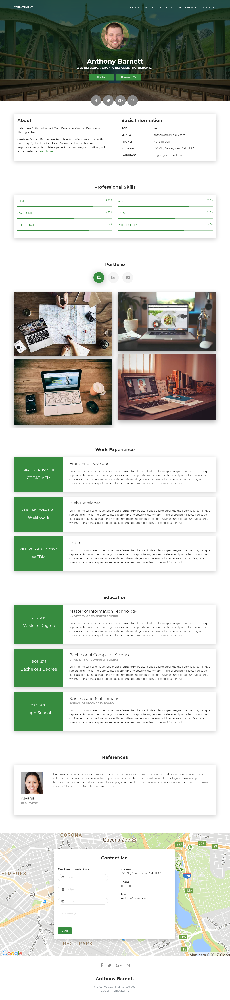

# Create your CV Site with Github

This is the repo for my website Curriculum that use the free template created by Creative CV. 

The website is hosted by **GitHub** (https://pages.github.com/) and with the pre-designed pipeline is very easy to update your site because every commit trigger the pipeline and update your page.

*Feel free to create your site taking this repo from example.*

## Directory **Structure**
-------------------
* **css**\: Stylesheets CSS files for the template.
* **images**\: Images used in template.
* **scripts**\: JavaScript used in the template.
* **styles**\: SCSS source files for stylesheets CSS. Available in Purchased versions only.
* **favicon.ico**: Favicon placeholder provided for the template.
* **index.html**: Main HTML page to open the template in browser.
* ***.html**: Additional HTML pages (if any).
* **LICENSE.txt**: License file as per your downloaded variant.

## **How to Edit** the template
------------------------

1. **Editing Content** in template

To edit the content open the corresponding *.html files and open them
in an editor such as VSCode or Notepad++.
Search for the content you want to change and edit it to the text you want.
Save the file and reopen HTML file in browser to see the changes.

2. **Editing Styles** of template

The main style is present in css\main.css which you can edit.
You must know how to edit CSS files to do this.
If you have purchased any of the premium version then you will also get
SCSS source files which generates all the styles of the template.
You can use these SCSS files to make your changes and regenerate CSS.

3. **Changing Images**

You can change images inside the images\ folder.
Make sure to name the file same as the original file.
If you wish to change the name of the image file then you must
also make corresponding change in the HTML file which refer to that image.

## **How to use** the template
------------------------
Upload the contents to your webserver.
index.html must be in the main (root) folder of your webserver.
Do not change the name of the template folders or files unless you know
what you are doing and are changing the names in HTML files too.
For webhosting, you can go with https://templateflip.com/go/hosting for easy FTP file uploads. 

## **Develop** in VSCode 
------------------------
For easily develop your website, I suggest to use VSCode with HTML5 plug-in that allow you to visualize the changes without commit every time.

## Useful **Links**
------------------------
- **icons**: https://fontawesome.com/v4/icons/ 
- **wallpapers**: https://unsplash.com/wallpapers

## Sample **Templates**
------------------------

